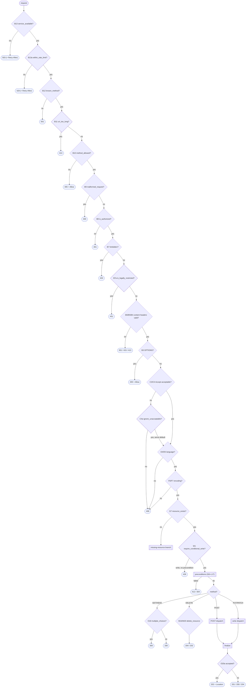

# The graph, drawn

This is asgimachine's *actual* walk — not the canonical webmachine v3 diagram it
descends from. It adds nodes webmachine predates (dashed, below), omits
`Accept-Charset`, and collapses webmachine's O/P success-status sub-tree into a
single finalizer. For the node-by-node accounting, see
[Coverage vs. webmachine](webmachine-coverage.md); this page is the map.

Dashed nodes are **additive** (a boolean callback with a correct default, traced
only when it fires). Double-boxed nodes are **sub-graphs** — expand them in the
drill-downs below.



The trunk is the happy path top-to-bottom; every decision branches sideways to the
status it halts with. `4xx`/`5xx` halts additionally get a negotiated RFC 9457
`problem+json` body (see [Negotiation & errors](negotiation.md)); a raised
exception is handled separately by [`on_exception`](observability.md).

## Drill-downs

??? note "Request gates — B13 → B3"
    The cheap, ordered rejections before any representation work. The body-validation
    trio (B9/B6/B5/B4) is traversed only for body-bearing methods.

    | Node | Question | Halt | Callback / declaration |
    |---|---|---|---|
    | B13 | service available? | 503 (+ Retry-After) | `service_available` |
    | B13a | within rate limit? *(additive)* | 429 (+ Retry-After) | `within_rate_limit` |
    | B12 | known method? | 501 | `KNOWN_METHODS` |
    | B11 | URI too long? *(additive)* | 414 | `uri_too_long` |
    | B10 | method allowed? | 405 + Allow | `allowed_methods` / `ALLOWED_METHODS` |
    | B9 | malformed request? | 400 | `malformed_request` |
    | B8 | authorized? | 401 (+ WWW-Authenticate) | `is_authorized` |
    | B7 | forbidden? | 403 | `forbidden` |
    | B7a | legally restricted? *(additive)* | 451 | `is_legally_restricted` |
    | B6 / B5 / B4 | content headers / type / length | 501 / 415 / 413 | `valid_content_headers` / `CONSUMES` / `MAX_BODY_BYTES` |
    | B3 | OPTIONS? | 200 + Allow | — |

??? note "Negotiation — C3/C4, D4/D5, F6/F7"
    Proactive negotiation. Each axis is negotiated only when the resource offers
    choices; `Accept-Charset` (webmachine's E nodes) is omitted by design.

    ```mermaid
    flowchart TD
        C4{"C3/C4 Accept?"} -->|no| C4a{"C4a serve-anyway?"}
        C4a -->|no| X406(["406"])
        C4a -->|yes| D5
        C4 -->|yes| D5{"D4/D5 language?"}
        D5 -->|no| X406
        D5 -->|yes| F7{"F6/F7 encoding?"}
        F7 -->|no| X406
        F7 -->|yes| OUT(["-> G7"])
        classDef additive stroke-dasharray:5 5,stroke:#7e57c2,stroke-width:2px;
        classDef status fill:#eef2ff,stroke:#8892d8,color:#333;
        class C4a additive;
        class X406,OUT status;
    ```

    Chosen values land on `ctx` (`chosen_media_type` / `chosen_language` /
    `chosen_encoding`) and set `Content-Type` / `Content-Language`; each offered axis
    is added to `Vary`.

??? note "Missing-resource branch — G7 = false"
    Where a resource that doesn't (currently) exist routes: create, redirect, gone,
    or not-found.

    ```mermaid
    flowchart TD
        G7(["G7 = false"]) --> H7{"If-Match present?"}
        H7 -->|yes| Y412(["412"])
        H7 -->|no| I7{"PUT?"}
        I7 -->|yes| P3{"P3 is_conflict?"}
        P3 -->|yes| Y409(["409"])
        P3 -->|no| Ycreate(["201 (create)"])
        I7 -->|no| K7{"K7 previously_existed?"}
        K7 -->|no| Y404(["404"])
        K7 -->|yes| K5{"moved?"}
        K5 -->|"moved_permanently"| Y301(["301"])
        K5 -->|"permanent_redirect (additive)"| Y308(["308"])
        K5 -->|"moved_temporarily"| Y307(["307"])
        K5 -->|no| Y410(["410"])
        classDef additive stroke-dasharray:5 5,stroke:#7e57c2,stroke-width:2px;
        classDef status fill:#eef2ff,stroke:#8892d8,color:#333;
        class Y412,Y409,Ycreate,Y404,Y301,Y308,Y307,Y410 status;
    ```

    Labelling note: asgimachine reuses **`L7`** for the terminal 404, where the
    canonical diagram uses `L7` for the "POST?" decision — the one knowing divergence.

??? note "Preconditions — G8 → L17"
    Conditional requests, evaluated in canonical order; each node is recorded only
    when it fires. `W1` (428) sits just before this block for writes.

    | Header | Nodes | Result |
    |---|---|---|
    | `If-Match` | G8/G11 | 412 on mismatch (strong comparison) |
    | `If-Unmodified-Since` | H10/H12 | 412 if known-modified (ignored when `If-Match` present) |
    | `If-None-Match` | I12/K13 | 304 (GET/HEAD) / 412 (writes) |
    | `If-Modified-Since` | L13/L17 | 304 (GET/HEAD, if `If-None-Match` absent) |

??? note "Write dispatch — POST / PUT / finalize"
    The method handlers converge on `_finish`, where `see_other` (303, POST only) and
    `accepted` (202) can override the completed-work status.

    ```mermaid
    flowchart TD
        subgraph sPOST["POST"]
            N11{"N11 post_is_create?"} -->|yes| CP["create_path + apply"]
            N11 -->|no| PP["process_post"]
        end
        subgraph sPUT["PUT / PATCH"]
            O14{"O14 is_conflict?"} -->|yes| Z409(["409"])
            O14 -->|no| AP["apply"]
        end
        CP --> SO{"N11a see_other?"}
        PP --> SO
        SO -->|yes| Z303(["303"])
        SO -->|no| FIN{"O20a accepted?"}
        AP --> FIN
        FIN -->|yes| Z202(["202 + Location"])
        FIN -->|"no, entity"| Z200(["200 / 201"])
        FIN -->|"no, none"| Z204(["204"])
        classDef additive stroke-dasharray:5 5,stroke:#7e57c2,stroke-width:2px;
        classDef status fill:#eef2ff,stroke:#8892d8,color:#333;
        class SO,FIN additive;
        class Z409,Z303,Z202,Z200,Z204 status;
    ```

    DELETE has its own terminal (`M16/M20` → 204/202 via `delete_completed`) and
    doesn't reach `_finish`.
